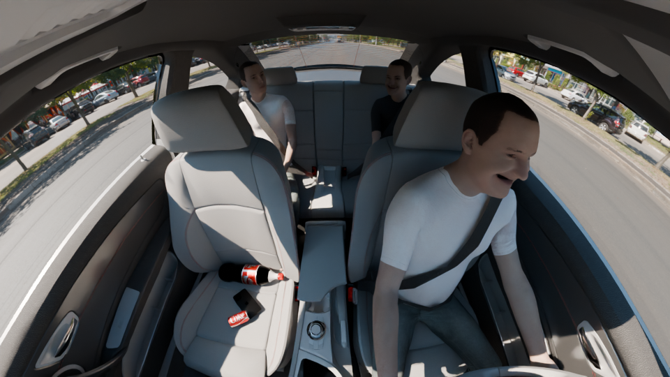
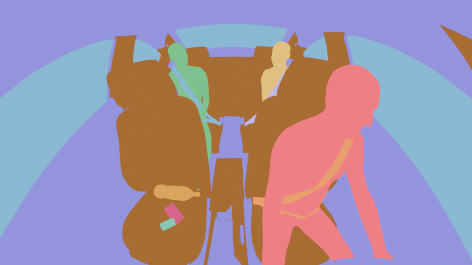
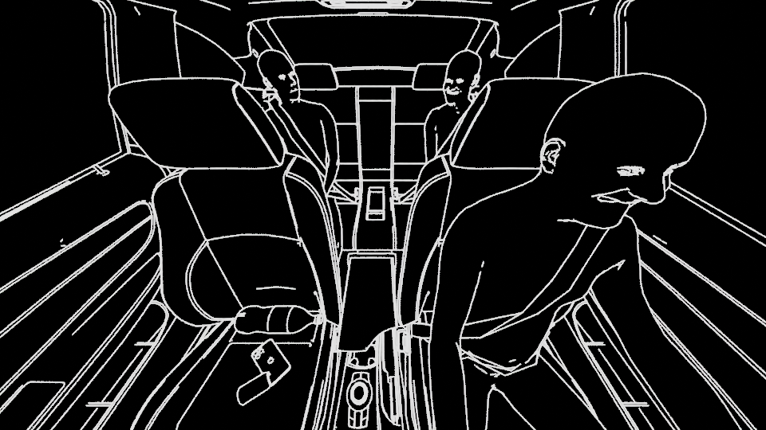
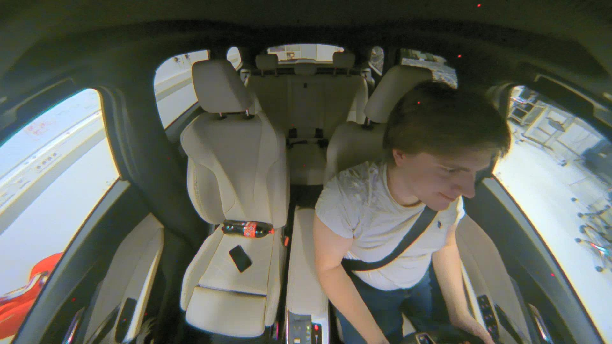

<h1 align="center">ISU-Challenge: Benchmarking Vision-Language Models for In-Car Scene Understanding</h1>

	
	

The **ISU-Challenge** is the first competition focused on testing and improving vision-language model (VLM) systems for in-car scene understanding (ISU), held at ICSE 2027.

In-cabin monitoring systems are increasingly important for detecting safety-relevant events such as driver distraction, while also supporting comfort and personalization features. VLMs offer a flexible way to interpret camera images from a vehicle interior, but they can still produce incorrect, incomplete, or overconfident descriptions. These failures are particularly important when a system is expected to answer questions about seat occupancy, seat-belt status, passengers, objects, or driver behavior.

Real-world in-cabin edge cases are expensive and difficult to collect at scale. The ISU-Challenge addresses this problem with a dual-track competition combining realistic scene generation, automated evaluation, and software-testing techniques.

### Example Data Channels

The starter kit includes synthetic scenes with auxiliary channels for Track A generated with [ISU-Test](https://github.com/ast-fortiss-tum/ISU-Test), as well as real
images for Track B. The examples below use the same synthetic scene where possible so that the
relationship between the RGB image, segmentation map, and Canny image is easy to see.

| Synthetic RGB image | Instance segmentation map | Canny edge map | Real in-car image |
| --- | --- | --- | --- |
|  |  |  |  |
| Source scene used by Track A. | False-color mask; see the [instance-segmentation legend](readme_assets/instance_seg_legend.json). | Edge information extracted from the synthetic scene. | Example real image provided for Track B. |

## 🏁 Competition Tracks

### 🧪 Track A: Test Generation
Track A is for participants who develop automated test generators. The goal is to generate realistic, diverse, and challenging in-car scenes that expose failures in VLM-based ISU systems while preserving the semantic and geometric ground truth of the source scene.

Participants use synthetic base scenes together with ground-truth annotations and auxiliary channels, such as depth maps and semantic segmentation maps. Test generators may diversify the visual appearance of the scenes, including:

- textures and materials;
- illumination and environmental conditions;
- passenger appearance and clothing
- other appearance-level variations that do not modify the underlying scene geometry, semantic structure and interior look and feel.

For the generated scenes, the ground-truth annotations of the source scene must remain valid. In particular, appearance transformations must not add, remove, move, or reshape semantically annotated objects, alter their spatial relationships, or otherwise modify the scene structure represented by the ground-truth annotations. For example, a participant may change a person's clothing or appearance, but may not change the person's location, body geometry, or the presence of safety-critical objects such as seat belts.

Transformations that modify the semantic or geometric structure of the scene are not permitted in Track A unless the corresponding ground-truth annotations are generated consistently and submitted with the transformed scene.

**Inputs**: Synthetic base scenes with ground-truth labels and auxiliary channels.

**Outputs**: A generated in-car scene dataset, together with the code required to generate the scenes and, where applicable, the corresponding ground-truth annotations.

Track A code and evaluation resources are available in [`track_a/`](track_a/), including the [participant starter notebook](track_a/participant_starter.ipynb), [challenge evaluator notebook](track_a/track_a_challenge_evaluator.ipynb), [metrics implementation](track_a/track_a_metrics.py), and [image metrics utilities](track_a/image_metrics_utils.py).

### 👁️ Track B: Perception Robustness

Track B is for participants who build robust ISU systems. The goal is to answer safety-relevant questions about synthetic and real in-car scenes, including questions about occupants, seat belts, objects, and driver or passenger behavior.

Systems should process visual in-car scenes and return predictions in the prescribed JSON format. The Track B evaluator uses `Qwen/Qwen2.5-VL-3B-Instruct` as its reference model. A starter collection of real in-car images is provided for training and validation, and the final evaluation uses a withheld test set containing both synthetic and real scenes.

**Inputs:** Varied synthetic and real in-car scenes together with the competition questions.

**Outputs:** A model, model parameters, reproducible inference code, and JSON-formatted visual question-answering predictions.

Track B code and evaluation resources are available in [`track_b/`](track_b/), including the [evaluator notebook](track_b/track_b_evaluator.ipynb) and [Python evaluator](track_b/track_b_evaluator.py).

### 🧩 Features

The benchmark describes each scene through a set of observable features. These labels cover driver behaviour, passenger occupancy, seat-belt usage, and the presence and location of objects in the cabin. Together, they define the questions that Track B systems must address and the semantic information that Track A generators must preserve when changing a scene's visual appearance.

The feature representation is intentionally structured so that every prediction can be compared directly with the ground truth. A scene may contain several simultaneous conditions, such as an occupied rear seat, an unfastened belt, and a suitcase in the rear. This supports both fine-grained failure analysis and diversity measurements across generated scenes.

The feature schema is summarized below. Boolean features use `YES` or `NO` unless stated otherwise.

| Category | Feature | Example value | Description |
| --- | --- | --- | --- |
| Driver behaviour | `driver_phone` | `NO` | Whether the driver is using a phone. |
| Passenger occupancy | `passenger_front_seat_right` | `NO` | Whether the front-right passenger seat is occupied. |
| Passenger occupancy | `passenger_back_seat_left` | `NO` | Whether the rear-left passenger seat is occupied. |
| Passenger occupancy | `passenger_back_seat_right` | `YES` | Whether the rear-right passenger seat is occupied. |
| Seat-belt usage | `front_left_safety_belt` | `YES` | Safety-belt status for the front-left seat. |
| Seat-belt usage | `front_right_safety_belt` | `NO` | Safety-belt status for the front-right seat. |
| Seat-belt usage | `rear_left_safety_belt` | `NO` | Safety-belt status for the rear-left seat. |
| Seat-belt usage | `rear_right_safety_belt` | `NO` | Safety-belt status for the rear-right seat. |
| Objects | `phone_codriver_seat` | `NO` | Whether a phone is present on the codriver seat. |
| Objects | `suitcase` | `YES` | Whether a suitcase is present. |
| Objects | `suitcase_location` | `REAR_SEAT` | Location of the suitcase. |
| Objects | `colabottle_codriver_seat` | `NO` | Whether a cola bottle is present on the codriver seat. |
| Objects | `colacan_codriver_seat` | `NO` | Whether a cola can is present on the codriver seat. |
| Child safety | `baby_seat` | `YES` | Whether a baby seat is present. |
| Child safety | `baby_seat_orientation` | `FRONT_FACING` | Orientation of the baby seat. |
| Child safety | `baby` | `NO` | Whether a baby is present. |

#### Example Feature Labels

The following synthetic scene demonstrates how the feature labels apply to an image. It shows a male driver wearing a white shirt and safety belt, two rear passengers, and several objects on the front-right seat.

| Feature | Label | Feature | Label |
| --- | --- | --- | --- |
| `driver_safety_belt` | `YES` | `driver_phone` | `NO` |
| `passenger_front_seat_right` | `NO` | `passenger_codriver_tshirt_color` | `null` |
| `passenger_codriver_emotion` | `null` | `codriver_safety_belt` | `NO` |
| `passenger_back_seat_left` | `YES` | `passenger_rear_left_tshirt_color` | `BLACK` |
| `passenger_rear_left_emotion` | `HAPPY` | `rear_left_safety_belt` | `YES` |
| `passenger_back_seat_right` | `YES` | `passenger_rear_right_tshirt_color` | `WHITE` |
| `passenger_rear_right_emotion` | `SERIOUS` | `rear_right_safety_belt` | `YES` |
| `suitcase` | `NO` | `suitcase_color` | `null` |
| `suitcase_location` | `null` | `suitcase_pose` | `null` |
| `phone_codriver_seat` | `YES` | `phone_codriver_seat_color` | `BLACK` |
| `colabottle_codriver_seat` | `YES` | `colacan_codriver_seat` | `YES` |
| `baby_seat` | `NO` | `baby_seat_orientation` | `null` |
| `baby` | `NO` |  |  |

## 🧰 Starter Kit

This repository provides the starter kit for the ISU-Challenge. It provides the data format, code to run the evaluation pipeline, and develop a first baseline for either track.

The starter kit includes:

- synthetic in-car scenes and their annotations;
- auxiliary channels such as depth, segmentation, and edge information;
- example real in-car data for the perception track;
- evaluation scripts for test generators and perception systems;
- Track B dependencies in `track_b/requirements.txt`;

- baseline Track A generators using image augmentation; and
- baseline Track B inference scripts using open-weight VLMs.

The starter kit is available on Kaggle and on the competition website.

## 📊 Evaluation

Both tracks use executable, automated evaluation pipelines.

### 🧪 Track A Metrics

- **Failure rate:** The number of scenes that expose a failure divided by the number of executed scenes, based on feature matching. The reference system under test is `Qwen/Qwen2.5-VL-3B-Instruct`. A separate industrial system will be used for the final evaluation.
- **Realism:** Will be disclosed after evaluation.
- **Diversity:** Feature diversity of failing scenes, following ISU-Test. Visual diversity of failing scenes is measured with CLIP; this captures changes such as clothing colour and style.
- **Efficiency:** Generation time. Is to be measured on the standardized `g6e.2xlarge` EC2 instance in final evaluation.

Track A results are ranked using Pareto non-dominance sorting across the competition objectives. In case of a tie, a weighted linear combination is used.

### 👁️ Track B Metrics

- **Accuracy:** Performance of visual question answering predictions.
- **Feature diversity:** Diversity of the features represented in the evaluated scenes.
- **Latency:** Time required to process a scene and produce its answer, measured on the predefined `g6e.2xlarge` EC2 instance with an NVIDIA L40S GPU.
- **Extended evaluation:** Submitted systems are evaluated on an extended real and synthetic dataset.

Track B participants train and evaluate with synthetic image data and a set of 50 real images collected by the organizers. Participants are also invited to collect additional real data. The final evaluation uses withheld real and synthetic scenes.

Participants can use [ISU-Test](https://github.com/ast-fortiss-tum/ISU-Test) to generate additional controllable synthetic in-car scenes for Track B development and training. Alternatively, they can use the synthetic and real images provided in the starter kit. Generated or provided scenes should use the competition feature definitions and labels so that predictions can be evaluated with the Track B pipeline.

### 🔍 Evaluation Models and Data

The baseline for Track A is `Qwen/Qwen2.5-VL-3B-Instruct`, and the final evaluation includes an industrial system to assess generalizability.

The organizers provide 1,000 synthetically generated images and 50 real in-car images collected by the organizers. These data are released under the MIT license. Participants can also collect real data for the features defined by the competition.

The exact output schemas, executable evaluation commands, and metric implementations are available in the starter kit.

## 🤝 Participation

The competition is open to participants from software engineering, computer vision, machine learning, and related communities. Teams may participate in one or both tracks.

To register, send the team or participant name, affiliation, and address to [lev.sorokin@tum.de](mailto:lev.sorokin@tum.de) with the subject **ISU-Challenge Registration Track A/B**. Registration details and deadlines will be announced with the competition launch. Provide ideally a Team name in case you participate as a group.

The competition is organized in connection with A* conference ICSE 2027. The top-ranked teams may be invited to submit solution papers to the ICSE 2027 Competition Track proceedings. Novel approaches may also be invited based on their methodological contribution, even if they do not achieve the highest leaderboard position.

## 📦 Submission Format

Submissions are made through the competition platform are to be evaluated on a withheld test set.

- **Track A:** Generated image archive and reproducible generation code.
- **Track B:** Model files, parameters, inference or training code, and predictions in the required JSON format.

Submissions must pass automated integrity and reproducibility checks. Track A outputs must preserve the required semantic and spatial information. Track B code submissions may be required for verification. All submission will be in addition manually reviewed.

## 🗓️ Timeline

The expected timeline is synchronized with ICSE 2027:

| Date | Event |
| --- | --- |
| September 2026 | Competition launch and starter-kit release |
| 4 December 2026 | Solution papers and organizer reports due |
| 16 December 2026 | Reviewer response for solution papers and organizer reports |
| 6 January 2027 | Revisions due for solution papers |
| 13 January 2027 | Final notification for solution papers |
| 20 January 2027 | Camera-ready deadline |
| 25 April - 1 May 2027 | ICSE 2027 in-person sessions |

## 🏆 Prizes

Prizes will be awarded to the first three winners in each track, with token packages worth up to $1,000 per track. In addition, the best accompanying papers will be published in the ICSE proceedings, and their authors will be invited to present their result at the conference in Dublin.

## 📝 Paper Selection

We will invite solution papers from the competition participants and accept at most five papers for the ICSE 2027 Competition Track proceedings. Submitted papers will be reviewed using soundness, writing quality and replicability. Approaches outside the top three teams in the track-metric ranking may still be invited for publication if they receive a sufficiently high paper-review score.

# ❓ FAQs

## 🧪 Track A

### What is a valid test input?

A valid Track A input is a synthetic in-car scene from the starter kit together with its available auxiliary channels, such as depth maps, semantic segmentation maps, and edge information. Participants may use these inputs to generate visually transformed scenes.

### What is the system output?

The output is a generated in-car scene dataset together with the reproducible code used to generate it. Each generated scene must preserve the semantic content and spatial geometry of its source scene such that the provided ground-truth labels remain valid after transformation.

### What does it mean to preserve the ground-truth labels?

Participants may modify the visual appearance of a scene, but must not modify the underlying semantic or geometric structure represented by the ground truth. In particular, transformations must not add, remove, move, or reshape semantically annotated objects or people, or change their spatial relationships.

For example, participants may change a person's clothing or appearance, or modify the texture and material of an object, provided that its location and geometry remain unchanged.

### Am I allowed to generate new labels?

Participants do not need to generate new labels for transformed scenes. Track A is designed around ground-truth-preserving transformations; therefore, the existing labels must remain valid after transformation.

### What happens if a transformation changes the segmentation?

If a transformation changes the semantic or geometric structure of the scene such that the provided segmentation or other required ground-truth labels are no longer valid, the generated scene does not satisfy the Track A validity requirements.

### Can I move, add, or remove objects or people?

No. Moving, adding, removing, or reshaping semantically annotated objects or people is not permitted in Track A because these operations can invalidate the provided ground-truth labels.

### How will realism be assessed?

Realism is assessed using the published metrics from the challenge and additional image metrics. Generated scenes must also pass semantic-validity checks, including preservation of the relevant objects, people, and spatial information.

### Can I use LLMs for image generation?

Yes. Participants may use LLMs, VLMs, diffusion models, image-to-image translation systems, or other generative techniques, provided that the resulting scenes are realistic, reproducible, and semantically valid. Any required model or API dependencies must be declared in the submission, and applicable token or compute limits must be respected.

## 👁️ Track B

### What is an interior scene understanding system?

An interior scene understanding system analyzes images from inside a vehicle and provides information, such as occupants, seat-belt status, driver behaviour, and objects in the cabin. In Track B, the system returns these predictions using the prescribed feature names and JSON format.

### Where can I get real data for training?

The starter kit provides 50 real in-car images collected by the organizers, together with the relevant labels. The data are provided for training and validation and are released under the MIT license. Participants may also collect additional real data using the instructions and recording script provided with the challenge.

### What does the interior scene understanding model need to predict?

The model must predict the observable scene features represented in the label JSON files. These include driver phone use, passenger occupancy, safety-belt status, suitcase presence and location, beverage objects, baby-seat configuration, and related cabin features. The required feature names and allowed values are defined by the provided labels and evaluation prompt.

### What format should predictions use?

Predictions must be returned as strict JSON objects using the prescribed feature names. Each evaluated feature should have one value, selected from the values allowed for that feature.

### How is Track B accuracy calculated?

The evaluator compares each predicted feature with the corresponding ground-truth value in the label JSON. Accuracy is reported at feature level, and scene-level exact match is also reported when all evaluated features for a scene are correct. Missing predictions for labeled features are counted as incorrect.

### Which images are used for evaluation?

Participants use the synthetic and real images supplied in the starter kit for development. The final evaluation uses a withheld extended dataset containing both synthetic and real in-car scenes, so systems should not rely on a single visual domain.

### Which model should I use?

The starter kit includes a baseline using the open-weight `Qwen/Qwen2.5-VL-3B-Instruct` model. The final evaluation is performed on the submitted system, not by requiring every participant to use the baseline model.

### How is latency measured?

Latency is the time required to process an image and produce its Track B prediction. For comparable results, final measurements are performed on the predefined `g6e.2xlarge` EC2 instance with an NVIDIA L40S GPU.

### Can I use external data or models?

Yes, but participants must document external datasets, pretrained models, and dependencies, and provide reproducible inference or training code. Submitted artefacts must comply with the applicable licenses.

## 👥 Organizers

- **Lev Sorokin**, BMW Group and Technical University of Munich
- **Rifaath Ameen**, BMW Group and FAU Erlangen-Nuremberg
- **Stefano Carlo Lambertenghi**, Technical University of Munich and fortiss GmbH
- **Chen Yang**, Technical University of Munich.

## 📚 Background

The ISU-Challenge builds on [ISU-Test](https://github.com/ast-fortiss-tum/ISU-Test), which can generate controllable synthetic interior scenes and evaluate in-car scene understanding systems. The underlying search-based testing approach is described in [Search-based Testing of Vision Language Models for In-Car Scene Understanding](https://arxiv.org/abs/2607.02300), which demonstrates systematic exploration of in-car scenarios to expose failures in both industrial and open-source VLM-based ISU systems. The competition extends this direction with more varied environments, additional passengers, real in-car data, and a focus on failure-oriented testing of VLMs.

## 📖 Reference

[1] S. C. Lambertenghi and A. Stocco, "Assessing Quality Metrics for Neural Reality Gap Input Mitigation in Autonomous Driving Testing," in *Proceedings of the 17th IEEE International Conference on Software Testing, Verification and Validation (ICST)*, 2024. doi: [10.1109/ICST60714.2024.00016](https://doi.org/10.1109/ICST60714.2024.00016).

[2] L. Sorokin, C. Yang, K. E. Friedl, and A. Stocco, "Search-based Testing of Vision Language Models for In-Car Scene Understanding," arXiv:2607.02300, 2026. [Online]. Available: [https://arxiv.org/abs/2607.02300](https://arxiv.org/abs/2607.02300). Accepted at the Industry Track of the 41st IEEE/ACM International Conference on Automated Software Engineering (ASE 2026).

## ⚖️ License

This repository is licensed under the [MIT License](LICENSE). 

## ✉️ Contact

For questions about the competition, registration, or collaboration, please contact [Lev Sorokin](mailto:lev.sorokin@tum.de) or [Rifaath Ameen](mailto:rifaath.ameen@fau.de).
